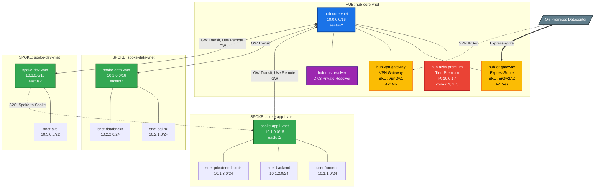

# Azure Hub & Spoke — Discovery & Audit Tool

## Requisitos Previos

```powershell
# Instalar módulos necesarios
Install-Module -Name Az.Accounts -Force -Scope CurrentUser
Install-Module -Name Az.Network  -Force -Scope CurrentUser
Install-Module -Name Az.DnsResolver -Force -Scope CurrentUser   # Opcional

# Autenticarse
Connect-AzAccount
```

## Ejecución

```powershell
# Opción 1: Todas las suscripciones accesibles
.\Discover-HubSpoke.ps1

# Opción 2: Suscripciones específicas
.\Discover-HubSpoke.ps1 -SubscriptionIds @(
    "a1b2c3d4-0000-1111-2222-333344445555",
    "e5f6g7h8-9999-8888-7777-666655554444"
)

# Opción 3: Directorio de salida personalizado
.\Discover-HubSpoke.ps1 -OutputPath "C:\Audits\NetworkReview"
```

## Archivos de Salida

| Archivo | Descripción |
|---|---|
| `best-practices-report.csv` | Resultado de los 5 checks de mejores prácticas |
| `hub-spoke-topology.mmd` | Diagrama Mermaid listo para renderizar |
| `inventory-vnets.csv` | Inventario completo de VNets con clasificación Hub/Spoke |
| `inventory-subnets.csv` | Todas las subnets con tipo (Gateway, Firewall, Standard) |
| `inventory-peerings.csv` | Todos los peerings con flags de GatewayTransit |
| `inventory-gateways.csv` | Gateways ER/VPN con SKU y estado AZ |
| `inventory-firewalls.csv` | Azure Firewalls con tier, zonas e IP privada |

---

## Checks de Mejores Prácticas

| # | Check | Qué Valida |
|---|---|---|
| 1 | **Spoke-Connectivity** | Que cada Spoke solo tenga peering hacia el Hub (sin Spoke-to-Spoke) |
| 2 | **Gateway-ZoneRedundancy** | Que los Gateways usen SKUs con sufijo `AZ` |
| 3 | **GatewayTransit-Hub** | Que `AllowGatewayTransit=True` en el lado Hub del peering |
| 3b | **GatewayTransit-Spoke** | Que `UseRemoteGateways=True` en el lado Spoke del peering |
| 4 | **ForwardedTraffic** | Que `AllowForwardedTraffic=True` para enrutamiento transitivo |
| 5 | **Firewall-ZoneRedundancy** | Que Azure Firewall esté desplegado en 2+ zonas |

### Ejemplo de Output en Consola

```
[14:32:01] [INFO] ═══════════════════════════════════════════════════════════
[14:32:01] [INFO]   OBJETIVO A — Evaluación de Mejores Prácticas
[14:32:01] [INFO] ═══════════════════════════════════════════════════════════

[14:32:01] [INFO] [CHECK 1] Validando que Spokes solo conecten al Hub...
[14:32:01] [OK]     ✓ spoke-app1-vnet → hub-core-vnet: OK (Hub)
[14:32:01] [OK]     ✓ spoke-data-vnet → hub-core-vnet: OK (Hub)
[14:32:01] [ERROR]  ✗ spoke-dev-vnet → spoke-test-vnet: Peering Spoke-to-Spoke

[14:32:02] [INFO] [CHECK 2] Validando Zone Redundancy en Gateways...
[14:32:02] [OK]     ✓ hub-er-gateway: SKU ErGw2AZ — Zone Redundant
[14:32:02] [ERROR]  ✗ hub-vpn-gateway: SKU VpnGw1 — SIN Zone Redundancy

[14:32:02] [INFO] [CHECK 3] Validando configuración de Gateway Transit...
[14:32:02] [OK]     ✓ Hub hub-core-vnet → spoke-app1-vnet: AllowGatewayTransit=True
[14:32:02] [ERROR]  ✗ Hub hub-core-vnet → spoke-data-vnet: AllowGatewayTransit=False
[14:32:02] [OK]     ✓ Spoke spoke-app1-vnet: UseRemoteGateways=True
[14:32:02] [ERROR]  ✗ Spoke spoke-data-vnet: UseRemoteGateways=False

[14:32:03] [INFO] ═══════════════════════════════════════════════════════════
[14:32:03] [INFO]   RESUMEN: 4 PASS | 4 FAIL | 1 WARNINGS
[14:32:03] [INFO] ═══════════════════════════════════════════════════════════
```

---

## Ejemplo de Diagrama Mermaid Generado

El siguiente es un ejemplo representativo del output que genera el script para una
arquitectura Hub & Spoke típica con 3 Spokes, ExpressRoute, VPN, Firewall y DNS Resolver.

Pegar este bloque en [mermaid.live](https://mermaid.live) para visualizar.



---

## Lógica de Clasificación Hub vs Spoke

El script clasifica automáticamente las VNets usando esta heurística:

**Una VNet es HUB si cumple al menos uno de estos criterios:**
1. Contiene un `GatewaySubnet` con un Gateway desplegado (ExpressRoute o VPN)
2. Contiene un `AzureFirewallSubnet` con un Azure Firewall
3. Tiene `AllowGatewayTransit = True` en al menos un peering

**Una VNet es SPOKE si:**
- No cumple ningún criterio de Hub
- Está conectada vía peering a una VNet clasificada como Hub

---

## Integración en Pipelines

### Azure DevOps (YAML)

```yaml
trigger:
  schedules:
    - cron: "0 6 * * 1"           # Cada lunes a las 6:00 AM
      branches:
        include: [main]

pool:
  vmImage: 'ubuntu-latest'

steps:
  - task: AzurePowerShell@5
    displayName: 'Hub & Spoke Audit'
    inputs:
      azureSubscription: 'my-service-connection'
      ScriptPath: '$(Build.SourcesDirectory)/Discover-HubSpoke.ps1'
      azurePowerShellVersion: 'LatestVersion'

  - publish: $(System.DefaultWorkingDirectory)/hub-spoke-output
    artifact: NetworkAuditReport
```

### GitHub Actions

```yaml
on:
  schedule:
    - cron: '0 6 * * 1'

jobs:
  audit:
    runs-on: ubuntu-latest
    steps:
      - uses: actions/checkout@v4
      - uses: azure/login@v2
        with:
          creds: ${{ secrets.AZURE_CREDENTIALS }}
      - name: Run Audit
        shell: pwsh
        run: ./Discover-HubSpoke.ps1
      - uses: actions/upload-artifact@v4
        with:
          name: network-audit
          path: hub-spoke-output/
```
